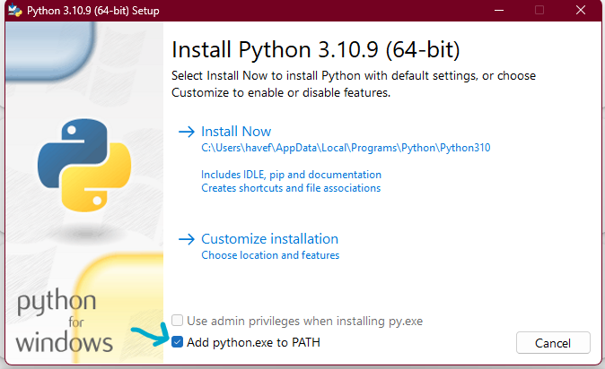
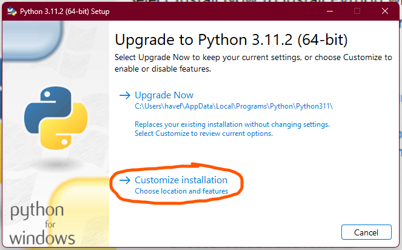
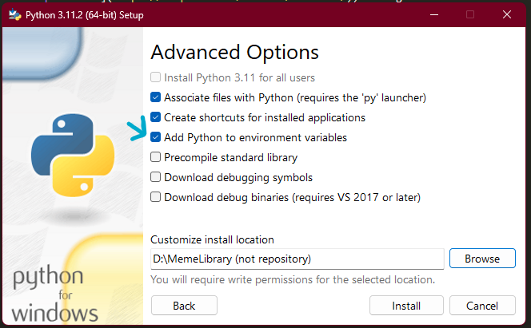

# 🤖 ReVanced Automatic Patcher
Determine if you can successfully patch an APK(s)

## Setup

### 0.1 Python
First, let's start by installing Python, this program recommends at least [Python 3.9 or higher](https://www.python.org/downloads/). Once you're in the installation, don't forget to check "Add python.exe to PATH".

> **Warning**  
> If you forget to check "Add python.exe to PATH", See "Troubleshooting".

Troubleshooting

If you've forgotten to check "Add python.exe to PATH", open the installation that you used to install Python and click on "Customise Installation" then check "Add Python to environment variables".

You're good to go!

### 0.2 Java Development Kit 
Now, let's install Open Java Development Kit, also known as OpenJDK! The ReVanced CLI recommends [Azul Zulu™ OpenJDK 17](https://www.azul.com/downloads/?package=jdk#download-openjdk), equivalent (e.g. [Eclipse Temurin™ OpenJDK 17](https://adoptium.net/temurin/releases/)) or higher.

### 0.3 Python Dependencies
Let's install the required dependencies to run RVAP. Open up the Terminal of your choice and run `pip install -r requirements.txt` in the same directory where `requirements.txt` exist.

#### Documentation
Continue: [Using the RVAP](1-using_RVAP.md)
